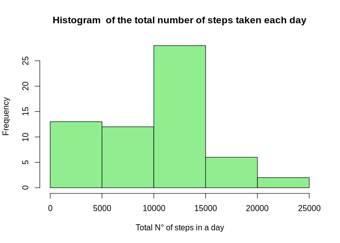
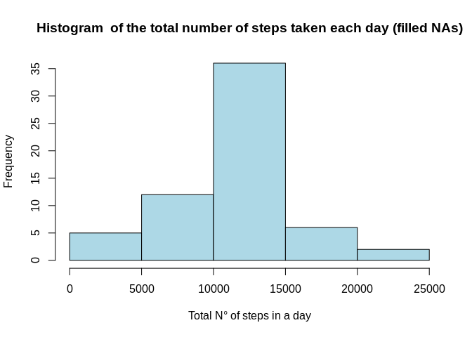
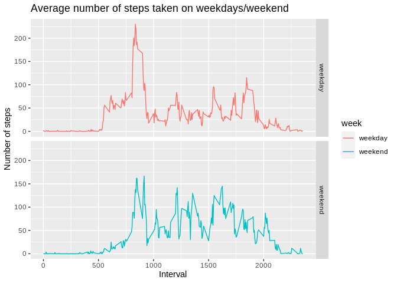

**Paquetes necesarios**

```r
library(dplyr)
```

```
## 
## Attaching package: 'dplyr'
```

```
## The following objects are masked from 'package:stats':
## 
##     filter, lag
```

```
## The following objects are masked from 'package:base':
## 
##     intersect, setdiff, setequal, union
```

```r
library(ggplot2)
```


## Loading and preprocessing the data

```r
data <- read.csv(unz("activity.zip", "activity.csv"))
```


## What is mean total number of steps taken per day?
1. Make a histogram of the total number of steps taken each day
2. Calculate and report the mean and median total number of steps taken
per day


```r
data %>% group_by(date) %>% summarise(totalsteps = sum(steps, na.rm = T)) -> data_days

hist(data_days$totalsteps, main = "Histogram  of the total number of steps taken each day", xlab = "Total N° of steps in a day", col = "lightgreen")
```

<!-- -->

```r
mean_steps <- round(mean(data_days$totalsteps), digits = 2)
median_steps <- median(data_days$totalsteps)
```
* The mean of total number of steps is **9354.23**.
* The median of total number of steps is **10395**.


## What is the average daily activity pattern?
1. Make a time series plot (i.e. type = "l") of the 5-minute interval (x-axis)
and the average number of steps taken, averaged across all days (y-axis)
2. Which 5-minute interval, on average across all the days in the dataset,
contains the maximum number of steps?


```r
data %>% group_by(interval) %>% summarise(av_steps = mean(steps, na.rm = T)) -> interval_data
interval_data <- as.data.frame(interval_data)

with(interval_data,plot(interval, av_steps, type = "l", col = "magenta", 
                        main = "Average number of steps across all days",
                        xlab = "Interval",
                        ylab = "Average number of steps"))
```

<!-- -->

```r
max_interval <- interval_data[which.max(interval_data$av_steps),]$interval
max_step <- round(interval_data[which.max(interval_data$av_steps),]$av_steps, digits = 2)
```
* The interval **835** has the maximum number of steps: **206.17**.


## Imputing missing values
1. Calculate and report the total number of missing values in the dataset
(i.e. the total number of rows with NAs)
2. Devise a strategy for filling in all of the missing values in the dataset. The
strategy does not need to be sophisticated. For example, you could use
the mean/median for that day, or the mean for that 5-minute interval, etc.
3. Create a new dataset that is equal to the original dataset but with the
missing data filled in.
4. Make a histogram of the total number of steps taken each day and Calculate
and report the mean and median total number of steps taken per day. Do
these values differ from the estimates from the first part of the assignment?
What is the impact of imputing missing data on the estimates of the total
daily number of steps?


```r
count_na <- sum(is.na(data$steps))
```
* The dataset has **2304** missing values.

* Strategy: Filling in missing values with **mean for that interval**.

```r
data_imput <- data

fill <- numeric()
for (i in 1:nrow(data_imput)) {
    datito <- data_imput[i, ]
    if (is.na(datito$steps)) {
        steps <- subset(interval_data, interval == datito$interval)$av_steps
    } else {
        steps <- datito$steps
    }
    fill <- c(fill, steps)
}

data_imput$steps <- fill

sum(is.na(data_imput$steps)) #chequeo que este correcto
```

```
## [1] 0
```

```r
data_imput %>% group_by(date) %>% summarise(totalsteps = sum(steps, na.rm = T)) -> data_days_NA

hist(data_days_NA$totalsteps, main = "Histogram  of the total number of steps taken each day (filled NAs)", xlab = "Total N° of steps in a day", col = "lightblue")
```

<!-- -->

```r
mean_steps_NA <- as.character(round(mean(data_days_NA$totalsteps), digits = 2))
median_steps_NA <- as.character(round(median(data_days_NA$totalsteps), digits = 2))
```
**Dataset with the missing data filled in:**
  
* The mean of total number of steps is **10766.19** vs 9354.23 (higher).
* The median of total number of steps is **10766.19** vs 10395 (higher).

Imputing missing data using the average of the 5-minute interval results in more data points equal to the mean and smaller variation of the distribution. Since many data points have the same values as the mean, the median is much likely to be the same as the mean as well.


## Are there differences in activity patterns between weekdays and weekends?
For this part the weekdays() function may be of some help here. Use the dataset
with the filled-in missing values for this part.
1. Create a new factor variable in the dataset with two levels – “weekday” and “weekend” indicating whether a given date is a weekday or weekend day.
2. Make a panel plot containing a time series plot (i.e. type = "l") of the 5-minute interval (x-axis) and the average number of steps taken, averaged across all weekday days or weekend days (y-axis).


```r
data_imput$day <- as.factor(weekdays(as.Date(data_imput$date)))
data_imput$week <- as.factor(ifelse(data_imput$day == "sábado" | data_imput$day == "domingo", "weekend", "weekday"))
head(data_imput)
```

```
##       steps       date interval   day    week
## 1 1.7169811 2012-10-01        0 lunes weekday
## 2 0.3396226 2012-10-01        5 lunes weekday
## 3 0.1320755 2012-10-01       10 lunes weekday
## 4 0.1509434 2012-10-01       15 lunes weekday
## 5 0.0754717 2012-10-01       20 lunes weekday
## 6 2.0943396 2012-10-01       25 lunes weekday
```

```r
act_week <- aggregate(steps ~ interval + week, data_imput, mean)
head(act_week)
```

```
##   interval    week      steps
## 1        0 weekday 2.25115304
## 2        5 weekday 0.44528302
## 3       10 weekday 0.17316562
## 4       15 weekday 0.19790356
## 5       20 weekday 0.09895178
## 6       25 weekday 1.59035639
```

```r
ggplot(data=act_week, aes(colour=week, x=interval, y=steps)) + geom_line()+labs(x="Interval", y="Number of steps", title="Average number of steps taken on weekdays/weekend") + facet_grid(week ~ .)
```

<!-- -->
